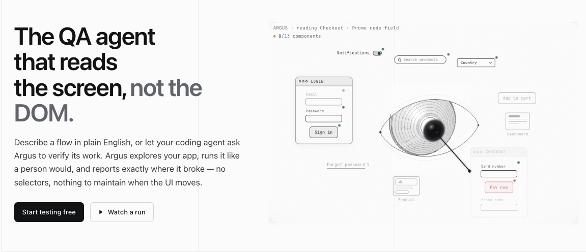
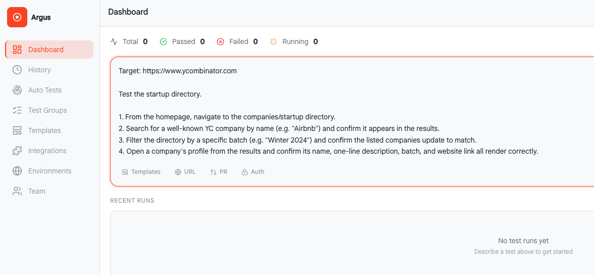
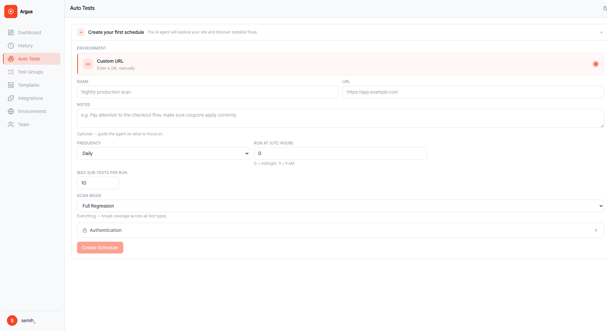
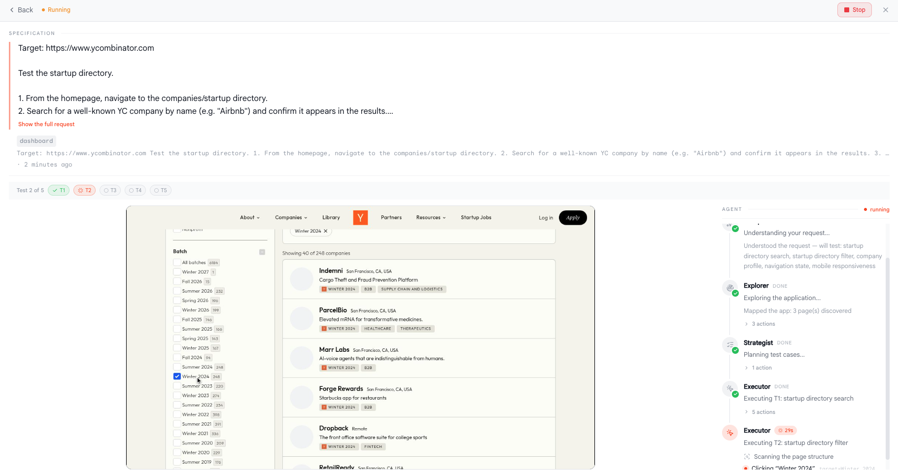
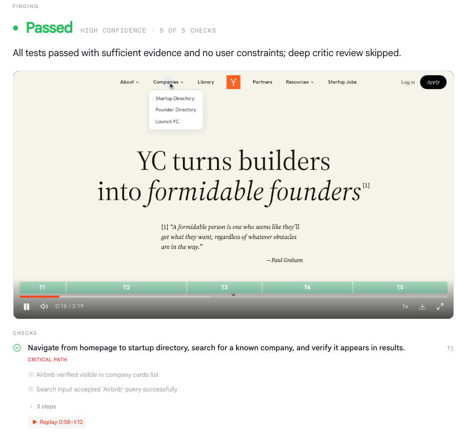
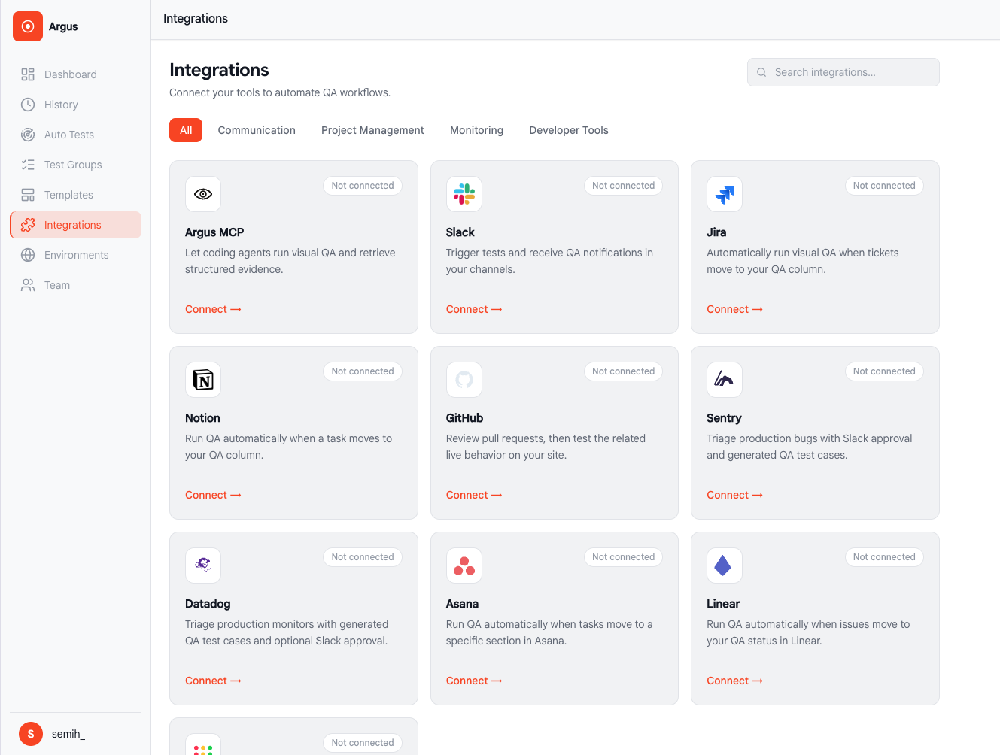

# Argus

**AI agents that test your UI like a real user — no scripts to write, no selectors to maintain.**



Argus is a visual UI testing agent. Describe a test, point it at an HTTP(S) page, and watch it inspect the page in an isolated Playwright browser context. Runs, timelines, screenshot references, and structured reports are captured automatically.

> **Argus finds the bugs you didn't write tests for.** Point it at a page, describe what "working" looks like, and an autonomous agent explores your UI the way a real user would — clicking, typing, scrolling — then hands you a structured report with screenshots and a timeline. No test scripts to maintain, no flaky selectors to babysit.



- **Agentic, not scripted** — the agent reasons about the page and adapts, it doesn't replay a fixed script
- **Fits your stack** — built on Playwright, works against localhost and private-network apps
- **Zero setup ceremony** — start testing in minutes

## Use the hosted platform

The fastest way to run Argus: no install, no API keys to manage, nothing to self-host.

Get started at [argustest.com](https://argustest.com/).

## Multi-agent pipeline

A run isn't a single model call — it's five agents handing off to each other, and you can watch each one work in the live run view:

1. **Validator** — checks the target URL and test description are actually testable before a run starts.
2. **Comprehender** — reads the test description and breaks it into distinct test cases.
3. **Explorer** — crawls the app first, mapping out pages and the actions available on each.
4. **Strategist** — turns the map and test cases into a concrete step-by-step plan.
5. **Executor** — runs the plan in a real browser: navigating, typing, clicking, and confirming outcomes as it goes.

Nothing happens in a black box — each agent streams its reasoning as it works, down to individual actions like "Navigating to /companies" or "Confirming 'Airbnb' is on the page," so you see the app get mapped, the plan get built, and the test get executed, live.

## Inside Argus









## Example

A test is just a description of intent — Argus figures out how to interact with the page. For example, pointed at Y Combinator's site:

```
Target: https://www.ycombinator.com

Test the startup directory.

1. From the homepage, navigate to the companies/startup directory.
2. Search for a well-known YC company by name (e.g. "Airbnb") and confirm it appears in the results.
3. Filter the directory by a specific batch (e.g. "Winter 2024") and confirm the listed companies update to match.
4. Open a company's profile from the results and confirm its name, one-line description, batch, and website link all render correctly.
5. Navigate back to the directory and confirm the search/filter state behaves as expected — either preserved or reset, whichever the page is designed to do.
6. Resize the viewport to 375px width and confirm the nav collapses into a mobile menu, and the directory list stays scrollable and usable with no overlapping elements.

Fail the test if the known company doesn't appear in search results, if the batch filter doesn't actually filter the list, if a company profile is missing expected fields, or if the mobile layout breaks.
```

Argus runs this like a person would — clicking through the flow, reading the page to judge success or failure — and returns a timeline, screenshots at each step, and a pass/fail report with the reasoning behind it.

## Run it yourself

Argus is source-available and fully local-first — SQLite storage, no telemetry, your data and screenshots never leave your machine. Prefer to self-host? Follow the steps below.

### Requirements

- Go 1.25+, Node.js 20.19+ or 22.12+, and a [Gemini API key](https://aistudio.google.com/app/apikey) for real runs

### Run locally

From the repository root:

```bash
cd frontend && npm install && npm run build && cd ..
go -C backend-go run ./cmd/argus install-browser
GEMINI_API_KEY=your-key GEMINI_MODEL=gemini-2.5-flash ARGUS_RUN_TIMEOUT=300 ARGUS_DB_PATH=data/argus.db PORT=8000 go -C backend-go run ./cmd/argus
```

Open <http://localhost:8000>. For frontend hot reload, run `npm run dev` in `frontend/` and the Go server in another terminal.

Configuration is environment-only:

| Variable | Default | Purpose |
| --- | --- | --- |
| `GEMINI_API_KEY` | — | Required for real execution |
| `GEMINI_MODEL` | `gemini-2.5-flash` | Gemini REST model |
| `ARGUS_RUN_TIMEOUT` | `300` | Run timeout in seconds |
| `ARGUS_DB_PATH` | `data/argus.db` | SQLite file; screenshots are stored beside it |
| `PORT` | `8000` | Go server port |
| `ARGUS_BASE_URL` | `http://127.0.0.1:8000` | Running local Argus REST server used by the MCP adapter |

### Connect an MCP client

Start Argus normally, then install the local stdio adapter from the repository root:

```bash
go install ./backend-go/cmd/argus-mcp
```

Ensure Go's bin directory (usually `$(go env GOPATH)/bin`) is on your `PATH`, then configure your MCP client:

```json
{
  "mcpServers": {
    "argus": {
      "command": "argus-mcp",
      "env": {"ARGUS_BASE_URL": "http://127.0.0.1:8000"}
    }
  }
}
```

The adapter exposes `start_test`, `get_test_run`, `list_test_runs`, `cancel_test`, and `get_test_evidence`. It connects only to the existing REST server; start Go Argus before using these tools. The same client-specific configuration and server status are available in **Settings → MCP setup**.

Argus accepts normal HTTP(S) targets, including trusted localhost and private-network apps. It rejects credentials and sensitive query parameters in target URLs, and never stores provider secrets, typed browser values, or inspected page content. The settings screen only shows whether provider configuration is present.

### Docker

```bash
cp .env.example .env
# Set GEMINI_API_KEY in .env
docker compose up --build
```

The UI is available at <http://localhost:8000> and persistent data is written to `./data`.

### Development checks

```bash
cd backend-go && go test -race ./... && go vet ./...
cd .. && uv run pytest
cd frontend && npm run typecheck && npm run lint && npm run build
```

### Architecture

- `backend-go/cmd/argus`: local REST/WebSocket server and built UI serving
- `backend-go/internal/runner`: Gemini pipeline, Playwright browser runs, SQLite evidence
- `backend-go/cmd/argus-mcp`: local stdio MCP adapter for the REST server
- `frontend`: dashboard/composer, live session, history, report, and read-only settings
- `argus/` and `tests/`: retained Python implementation and tests during the Go transition

All data is local; there is no authentication or multi-user isolation in this release.

## License

Argus is source-available under the [Argus Source-Available License 1.0 (ASAL-1.0)](LICENSE).

- **Individuals & Small Teams (< 100 members):** Free to use, modify, and self-host for both commercial and non-commercial purposes.
- **Enterprises (100+ members):** Requires a commercial license. Contact us at [licensing@argustest.com](mailto:licensing@argustest.com) to get set up.
- Releases automatically convert to the **MIT License** after 3 years.
